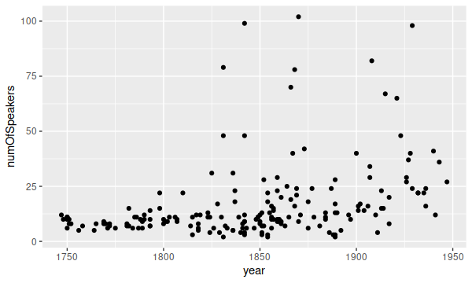

# RusDraCor
## Corpus Description
We are building a Russian Drama Corpus with files encoded in
[TEI-P5](http://www.tei-c.org/Guidelines/P5/). Our corpus comprises
**120 plays** to date, stemming from [ilibrary](https://ilibrary.ru/),
[Wikisource](https://ru.wikisource.org/), [РВБ](https://rvb.ru/),
[lib.ru](http://lib.ru/), [ФЕБ](http://feb-web.ru/),
[СовЛит](http://www.ruthenia.ru/sovlit/) and
[Wikilivres](https://wikilivres.org/), converted to TEI and corrected
by us. There will be more.

If you want to reference the corpus in a paper, please use this publication:

- **Skorinkin D., Fischer F., Palchikov G. (2018)**: Building a Corpus for the Quantitative Research of Russian Drama: Composition, Structure, Case Studies. *Proceedings of the International Conference "Dialogue 2018"*, pp. 662–682. (**[PDF](http://www.dialog-21.ru/media/4332/skorinkind.pdf)**)

If you just want to download the corpus in its current state in XML-TEI,
do this (*edit:* does not seem to work with svn 1.11):

`svn export https://github.com/dracor-org/rusdracor/trunk/tei`

RusDraCor was first presented on June 29, 2017, at the [Corpora 2017
conference](https://events.spbu.ru/events/anons/corpora-2017/?lang=Eng) in St.
Petersburg ([our slides here](https://dlina.github.io/presentations/2017-spb/)),
on July 11, 2017, at the ["Digitizing the stage"
conference](https://digitizingthestage.wordpress.com/) in Oxford and
on November 14, 2017, at the
[TEI 2017 conference](https://hcmc.uvic.ca/tei2017/abstracts/t_115_fischeretal_lifeonstage.html)
in Victoria. The social network data we extract from plays may also be explored
with [our Shinyapp](https://shiny.dracor.org/).

## API

An easy way to download the network data (instead of the actual TEI files) is
to use our API ([documentation](https://dracor.org/documentation/api/)).
If you have [jq](http://blog.librato.com/posts/jq-json) installed, it would work
like this:

```
for play in `curl 'https://dracor.org/api/corpora/rus' | jq -r ".dramas[] .id"`; do
    wget -O "$play".csv https://dracor.org/api/corpora/rus/play/"$play"/networkdata/csv
done
```

The API info page is at `https://dracor.org/api/info`.

## Simple Visualisation with R

To have a first look at the distribution of the number of speakers per play over
time, you could feed the metadata table into R:

```
library(data.table)
library(ggplot2)
rusdracor <- fread("https://dracor.org/api/corpora/rus/metadata.csv")
ggplot(rusdracor[], aes(x = year, y = numOfSpeakers)) + geom_point()
```

Result:



(README last updated on November 19, 2018.)
